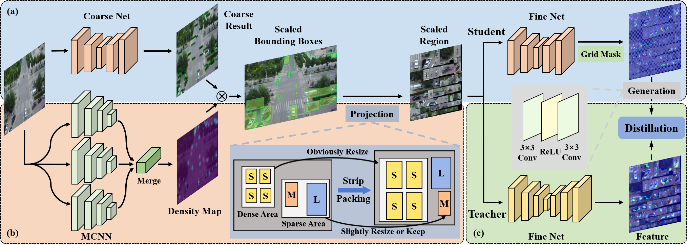

# Official Implementation of "Small Object Detection Leveraging Density-Aware Scale Adaptation"

### [Paper Link](https://onlinelibrary.wiley.com/doi/10.1111/phor.12446)

## Abstract

#### Albeit general object detection has made impressive progress in the last decade, as a significant subfield, small object detection still performs far from satisfactorily, which is impeded by several challenges, such as small size, severe occlusion and variant scales. To tackle these challenges, we propose a coarse-to-fine small object detection method leveraging density-aware scale adaptation. Firstly, we employ global sketchy prediction via a coarse network in large scenes and generate adaptively scaled block regions with potential targets. Subsequently, we perform local accurate detection by a fine network for instances in densely packed areas with approximately unified scales. In particular, a density map with object distribution information is utilised to provide a scene classification auxiliary to instruct scale transformation. Extensive experiments on the popular remote sensing benchmark AI-TOD and representative small object datasets VisDrone and UAVDT demonstrate the superiority of our method for small object detection, achieving an improvement of 2.9% mAP-vt and 2.1% mAP on AI-TOD, and outperforming the state-of-the-art methods on VisDrone and UAVDT with an enhancement of 1.7% mAP and 2.0% mAP50, respectively.


## Overview



## Highlight

 - [x] Support representative small object detection datasets, include [VisDrone](https://github.com/VisDrone/VisDrone-Dataset), [UAVDT](https://github.com/jwangjie/UAV-Vehicle-Detection-Dataset), [AI-TOD](https://github.com/jwwangchn/AI-TOD), and [COCO](https://cocodataset.org/).

## TODO

 - [x] Release the eval code.
 - [x] Release the train code.


## Data Prepare

Take the VisDrone dataset for an example.

#### VisDrone to COCO Format

```shell
python ./tools_det/dataset/VisDrone2COCO.py 
```

#### Get Fine Image

Afer the coarse training stage

```shell
# train dataset

python tools_det/dataset/VisDrone_getFine.py
./work_dirs/gfocal_r50_fpn_1x_ciou_pretrained/gfocal_r50_fpn_1x_ciou_pretrained.py
./work_dirs/gfocal_r50_fpn_1x_ciou_pretrained/epoch_12.pth
./data/VisDrone/VisDrone2019-DET-train/images
./data/VisDrone/annotations/instances_train2017.json
./data/VisDrone/VisDrone2019-DET-train-gfocal_r50_fpn_1x_ciou_pretrained/images
./data/VisDrone/annotations/instances_train2017_gfocal_r50_fpn_1x_ciou_pretrained.json
--txt_path ./data/VisDrone/VisDrone2019-DET-train/annotations

```

```shell
# eval dataset

python tools_det/dataset/VisDrone_getFine.py
./work_dirs/gfocal_r50_fpn_1x_ciou_pretrained/gfocal_r50_fpn_1x_ciou_pretrained.py
./work_dirs/gfocal_r50_fpn_1x_ciou_pretrained/epoch_12.pth
./data/VisDrone/VisDrone2019-DET-val/images
./data/VisDrone/annotations/instances_val2017.json
./data/VisDrone/VisDrone2019-DET-val-gfocal_r50_fpn_1x_ciou_pretrained/images
./data/VisDrone/annotations/instances_val2017_gfocal_r50_fpn_1x_ciou_pretrained.json
--txt_path ./data/VisDrone/VisDrone2019-DET-val/annotations
```

You will get the dataset folder structure as:

```
--data
 |-annotations
   |-instances_train2017.json
   |-instances_train2017_gfocal_r50_fpn_1x_ciou_pretrained.json
   |-instances_val2017.json
   |-instances_val2017_gfocal_r50_fpn_1x_ciou_pretrained.json
 |-VisDrone2019-DET-train
   |-images
     |-0000002_00005_d_0000014.jpg
     |-...
   |-dens_MCNN
     |-0000002_00005_d_0000014.npy
     |-...
 |-VisDrone2019-DET-train-gfocal_r50_fpn_1x_ciou_pretrained
   |-images
     |-0000002_00005_d_0000014.jpg
     |-...
 |-VisDrone2019-DET-val
   |-images
     |-0000001_02999_d_0000005.jpg
     |-...
   |-dens_MCNN
     |-0000001_02999_d_0000005.npy
     |-...
 |-VisDrone2019-DET-val-gfocal_r50_fpn_1x_ciou_pretrained
   |-images
     |-0000001_02999_d_0000005.jpg
     |-...
```


## Test

First download the following checkpoints and save to './checkpoint'

| Checkpoint | Download Link |
|-------|-------|
| gfocal_r50_fpn_1x.pth | [Baidu Disk](https://pan.baidu.com/s/16SHmw4i-lVCC8YHVLADfJA?pwd=6666) |
| gfocal_r50_fpn_1x_ciou_pretrained.pth | [Baidu Disk](https://pan.baidu.com/s/1h5yMBikbpmLpgYSmHKiMmA?pwd=6666) |
| fine_gfocal_r50_fpn_1x_ciou_pretrained.pth | [Baidu Disk](https://pan.baidu.com/s/1nrXvNQo6J5qhhKzyVpXNBQ?pwd=6666) |


```shell
python tools_det/eval/VisDrone_eval.py ./configs/my_expn/gfocal/gfocal_r50_fpn_1x_ciou_pretrained.py ./checkpoint/gfocal_r50_fpn_1x_ciou_pretrained.pth ./configs/my_expn/gfocal/fine_gfocal_r50_fpn_1x_ciou_pretrained.py ./checkpoint/fine_gfocal_r50_fpn_1x_ciou_pretrained.pth ./data/VisDrone/annotations/instances_val2017.json ./data/VisDrone/VisDrone2019-DET-val/images/
```

## Train

#### Coarse Stage

```shell
python tools/train.py ./configs/my_expn/gfocal/gfocal_r50_fpn_1x_ciou_pretrained.py

```

#### Fine Stage

```shell
python tools/train.py ./configs/my_expn/gfocal/fine_gfocal_r50_fpn_1x_ciou_pretrained.py
```

#### Distillation Stage

```shell
python tools/train.py ./configs/my_expn/gmd/self_distill_gfocal_r50_fpn_1x_ciou_pretrained.py
```


## Cite

```
@article{https://doi.org/10.1111/phor.12446,
author = {Wan, Yu and Liao, Zhaohong and Liu, Jia and Song, Weiwei and Ji, Hong and Gao, Zhi},
title = {Small object detection leveraging density-aware scale adaptation},
journal = {The Photogrammetric Record},
volume = {38},
number = {182},
pages = {160-175},
keywords = {coarse-to-fine, scale adaptation, small object detection},
doi = {https://doi.org/10.1111/phor.12446},
year = {2023}
}

```
